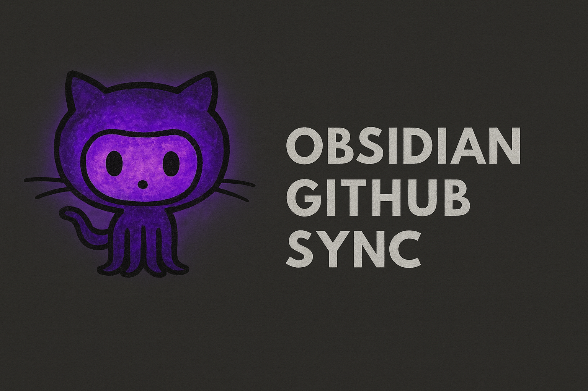

# GitHub Readme Sync 📚



An Obsidian plugin that syncs your GitHub repositories' Markdown files to your vault. One-way sync (GitHub → Obsidian) that preserves folder structure and keeps your project docs organized.

## Features

- 🔍 **Auto-discovery** - Finds repositories from your GitHub username/organization
- 📁 **Structure mirroring** - Preserves repo folder structure so links work
- 🎯 **Filtering** - Include/exclude private repos, forks, archived repos with glob patterns  
- 🖼️ **Media files** - Sync images, videos, and other media files (optional)
- 🔒 **Private repos** - Access private repositories with GitHub token
- ⚠️ **Read-only protection** - Marks synced files to prevent accidental edits
- ⚡ **Manual + auto sync** - "Sync now" command and periodic background sync
- 📂 **Organization** - Files go to `Projects/<owner>/<repo>/<path>`

## Installation (Development)

1. Clone this repository to your Obsidian vault's plugins folder:
   ```bash
   cd /path/to/your/vault/.obsidian/plugins
   git clone https://github.com/tctibbs/obsidian-github-readme-sync.git
   cd obsidian-github-readme-sync
   ```

2. Install dependencies:
   ```bash
   npm install
   ```

3. Build the plugin:
   ```bash
   npm run build
   ```

4. Enable the plugin in Obsidian settings under **Community Plugins**

## Configuration

1. Open **Settings → GitHub Readme Sync**
2. Add your **GitHub Personal Access Token**
3. Enter your **GitHub username** for auto-discovery
4. Configure repository filters and sync options
5. Use the **"Sync Now"** button to start syncing

## Folder Structure

The plugin mirrors your repository structure exactly:

```
Projects/
├── you/
│   └── my-project/
│       ├── README.md
│       ├── docs/
│       │   └── getting-started.md
│       └── database/
│           └── readme.md
└── yourorg/
    └── team-docs/
        ├── README.md
        └── guides/
            └── deployment.md
```

## File Processing

Each synced Markdown file includes:

1. **Frontmatter** with sync metadata:
   ```yaml
   ---
   github_repo: owner/repo
   github_path: path/to/file.md
   github_url: https://github.com/owner/repo/blob/main/path/to/file.md
   synced_at: 2025-01-15T10:30:00Z
   readonly: true
   ---
   ```

2. **Read-only banner** at the top:
   ```markdown
   > [!WARNING] Read-Only
   > This file is synced from GitHub. Any local changes will be overwritten.
   > View source: [owner/repo](https://github.com/owner/repo/blob/main/path/to/file.md)
   ```

## Commands

- **GitHub Readme Sync: Sync Now** - Manually trigger a full sync of all configured repositories

## GitHub Token Setup 🔑

You need a GitHub Personal Access Token to use this plugin:

1. Go to https://github.com/settings/tokens
2. Click "Generate new token (classic)"
3. Name it "Obsidian Sync" or similar
4. Select scopes:
   - `public_repo` - For public repositories only
   - `repo` - For both public and private repositories  
5. Set expiration date
6. Copy token to plugin settings

**Scope guide:**
- Public repos only → `public_repo` scope
- Private repos → `repo` scope (includes public)

## Limitations

- **One-way sync only**: Changes in Obsidian are not pushed back to GitHub
- **Desktop only**: Not compatible with Obsidian Mobile
- **Rate limits**: Respects GitHub API rate limits (5000 requests/hour for authenticated users)

## File Types Supported

- **Markdown files**: `.md` and `.mdx` files (always synced)
- **Media files** (optional): `.png`, `.jpg`, `.jpeg`, `.gif`, `.svg`, `.webp`, `.bmp`, `.ico`
- **Video files** (optional): `.mp4`, `.mov`, `.avi`, `.webm`
- **Audio files** (optional): `.mp3`, `.wav`
- **Documents** (optional): `.pdf`

## Future Features 🚀

- 📦 **Official plugin directory** - Submit to community plugins for easier installation  
- 🎛️ **Custom file filters** - Configure which file types to sync
- 📱 **Mobile support** - May not be feasible due to API limitations (Obsidian Sync might be better)

## License

MIT License - see [LICENSE](LICENSE) file for details.

## Support

If you find this plugin helpful, consider:
- ⭐ Starring the repository
- 🐛 Reporting issues on GitHub
- 💡 Suggesting new features

